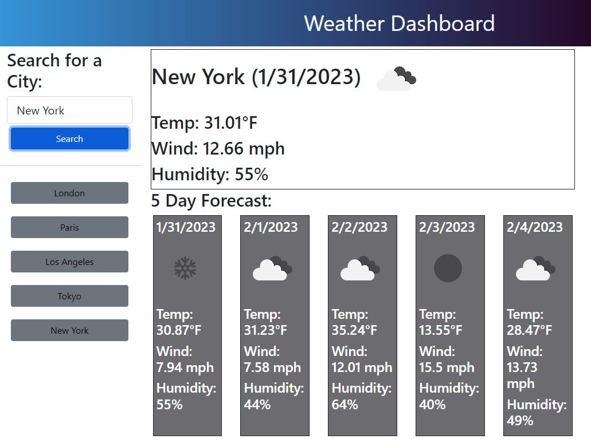

## Description
A 5 day weather forecast for the city of your choice. 
Click [here](https://aforkinthecode.github.io/weatherforecast/) to get started.

# Installation
n/a
## Usage
Simply enter the city in the input area and hit the search button.   A console will pop up displaying the forecast for the next 5 days.  The search history will appear below the search button.  To view the conditions for previous cities click the button to view the desired city.

## apis, frameworks, libraries used
Bootstrap
jQuery
Openweather

## License
MIT License
